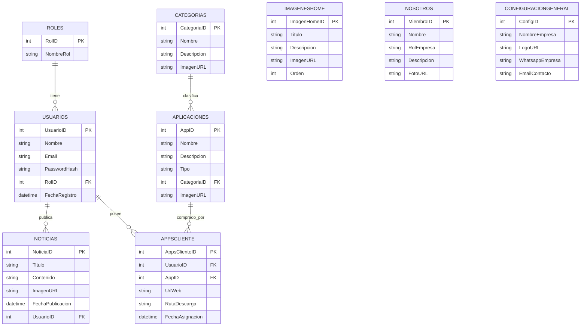
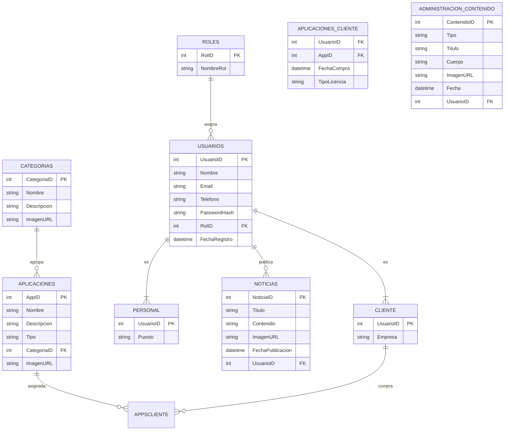

# WebPredits
No menos importante antes de comenzar con la lectura cabe destacar que no somos una empresa que se dedique a realizar tiendas online o landings, si bien sabemos que trabajo es trabajo y lo podemos tomar, nuestra orientación es la creación de aplicaciones que gestionen negocios. Es decir, en simples palabras facilitar la administración de un negocio.

Necesitamos tener una pagina web para poder documentar todos nuestros logros y poder por consecuente, atraer a clientes. La pagina debe ser simple una landing page.

Donde tenga un navbar con
Inicio
Noticias
Comprar
Nosotros

Ingresar ( otra web )

Antes de empezar con el desarrollo de cada sección, esta pagina tiene que estar pensada para ser administrada por el sector de marketing de la empresa, es decir, no tiene que existir la necesidad de programar para realizar un post.
Para ello propongo la siguiente solución →
tenemos comprado un host llamado [predits.com.ar](http://predits.com.ar) al pertenecernos nos hace propietarios de todo lo que hagamos con esa dirección.
Debemos crear un panel, es decir, predits/Administrador que pueda administrar, digamos, hacer un AMV de todo lo que se pueda modificar en la pagina wen, Recuerda, no se debe existir la necesidad de programar.

Ahora si arranquemos con las pestañas

# **SECCIONES**

## **INICIO**

Debe ser simple. Mostrar imágenes del producto final, no código. Incluir textos claros que expliquen para qué sirve cada solución y qué problemas resuelven.

## **NOTICIAS**

Secciones donde se publican desafíos, avances, posteos, notas, comentarios de clientes y todo lo que sirve para documentar el trabajo.

## **COMPRAR**

Listado de categorías según los nichos: tiendas de ropa, kioscos, inmobiliarias, celulares, etc.

Cada card debe incluir:

- Imagen estilo Mercado Libre
- Nombre del nicho
- Breve descripción
- Botón **Contactar**
    
    El botón abre WhatsApp con mensaje personalizado.
    

## **NOSOTROS**

Presentación del equipo, roles, lo que hace cada uno y por qué el cliente puede confiar en nosotros ( podemos poner nuestras redes para que confien mas ) .

## **INGRESAR (predits/login)**

Al hacer clic, se abre un login.

- Si el cliente compró una app **web**, se lo redirige a su aplicación (ej: predits/apps/tiendaCelular/usuarioX).
- Si la app es **de escritorio**, se lo lleva a la sección con instaladores y actualizaciones.

# **ACTORES CLAVES**

1. **Visitante**
    
    Entra a la landing sin registrarse. Ve productos, noticias y contacto.
    
2. **Cliente**
    
    Compró una app. Puede iniciar sesión, acceder a su aplicación y descargar actualizaciones o descargar la app.
    
3. **Administrador**
    
    Desarrolla, gestiona usuarios, configuraciones y la estructura general del sistema.
    
4. **Marketing**
    
    Encargado de cargar contenido: noticias, imágenes, textos, categorías, datos de contacto.
    

# **OBJETIVO DEL SISTEMA**

Centralizar:

- la presentación de la empresa,
- la comunicación con el cliente,
- la venta de nuestras apps por nichos,
- el acceso seguro a las aplicaciones y sus actualizaciones,
- la gestión del contenido sin necesidad de programar.

# **ALCANCE**

### **Incluye**

- Landing page completa editable desde panel administrador.
- Login de clientes.
- Redirección a apps web o links de actualización.
- Gestión de categorías, noticias, imágenes y textos.
- Dashboard para administradores y marketing.
- Generación de leads vía WhatsApp.

### **No incluye**

- Carrito de compras o pagos online.
- Módulos internos de cada aplicación vendida.
- Facturación automatizada.
- Soporte técnico desde la web (solo contacto).

# **REQUERIMIENTOS FUNCIONALES**

1. **RF01 – Panel de administración**
    
    Debe permitir crear, editar y borrar contenido sin programar.
    
2. **RF02 – Noticias**
    
    CRUD completo con imágenes y editor WYSIWYG.
    
3. **RF03 – Comprar**
    
    CRUD de categorías y apps por nicho (imagen, descripción, mensaje predefinido, etc.)
    
4. **RF04 – Login de clientes**
    
    Validación por usuario/contraseña.
    
    Consulta sus productos y redirige según tipo (web/escritorio).
    
5. **RF05 – Redirección automática**
    
    Si es web, ir al enlace asignado.
    
    Si es escritorio, mostrar instaladores.
    
6. **RF06 – WhatsApp integrado**
    
    Botón Contactar genera un mensaje personalizado.
    
7. **RF07 – Nosotros**
    
    CRUD de miembros del equipo.
    
8. **RF08 – Inicio editable**
    
    CRUD de imágenes y textos principales.
    

---

# **REQUERIMIENTOS NO FUNCIONALES**

1. **RNF01 – Usabilidad**
    
    Interfaz simple, intuitiva y rápida.
    
2. **RNF02 – Seguridad**
    
    Hash de contraseñas, control de roles, HTTPS obligatorio.
    
3. **RNF03 – Escalabilidad**
    
    Estructura modular preparada para agregar más secciones.
    
4. **RNF04 – Rendimiento**
    
    Carga rápida, imágenes optimizadas, caching básico.
    
5. **RNF05 – Mantenibilidad**
    
    Código limpio, MVC, variables CSS globales, arquitectura monolítica modular.
    
6. **RNF06 – Compatibilidad**
    
    Navegadores modernos, versión móvil y escritorio.
    

# **CASOS DE USO**

### **CU01 – Visitante ve productos**

1. Entra a /Comprar
2. Ve categorías
3. Elige una
4. Presiona Contactar
5. Se abre WhatsApp con mensaje automático

### **CU02 – Marketing publica una noticia**

1. Inicia sesión en /Administrador
2. Va a Noticias
3. Crea nueva noticia
4. Carga imagen, texto y guarda

### **CU03 – Cliente accede a su app**

1. Entra a /login
2. Ingresa usuario y contraseña
3. El sistema muestra sus apps
4. Selecciona la app
5. El sistema redirige o muestra descargas

### **CU04 – Administrador administra categorías**

1. Entra a /Administrador
2. Va a Categorías
3. Agrega nombre, imagen, descripción
4. Guarda

---

# **FLUJO DE TRABAJO**

## **Visitante**

- Entra
- Navega Inicio / Noticias / Comprar
- Si le interesa, toca Contactar
- Se comunica por WhatsApp
- Puede convertirse en cliente

## **Cliente**

- Compra una app fuera de la web
- Desde /login accede a su producto
- Si es web → redirección
- Si es escritorio → descargas
- Revisa novedades en Noticias

## **Administrador**

- Alta de usuarios
- Control de apps, categorías y configuraciones
- Administración general del sistema

## **Marketing**

- Publica noticias
- Actualiza textos e imágenes del home
- Gestiona categorías y descripciones
- No toca código

---

# **TECNOLOGÍAS A USAR**

- **Frontend:**
    
    **Vue 3 + TypeScript**
    
    Router, componentes reutilizables, consumo de API.
    
- **Backend / API:**
    
    **.NET C#**
    
    Arquitectura monolítica con diseño modular **MVC**.
    
- **Base de datos:**
    
    **MySQL**
    
- **Servidor:**
    
    predits.com.ar (hosting propio)
    
- **Autenticación:**
    
    JWT o cookies seguras según preferencia del equipo.
    

# **TABLA DE COLORES Y LINEAMIENTOS DE DISEÑO**

Diseño minimalista, oscuro, moderno y limpio.

Ejemplo de paleta base (ajustable según logo):

- `-color-bg: #0f0f0f`
- `-color-bg-alt: #1a1a1a`
- `-color-primary: #3a78ff`
- `-color-secondary: #6c6c6c`
- `-color-text: #ffffff`
- `-color-text-alt: #cfcfcf`

### **Archivo global de CSS ( TOMAR ESTO COMO UN EJEMPLO PARA IMPORTAR EL ARCHIVO):**

`/assets/styles/variables.css`

```css
:root {
  --color-bg: #0f0f0f;
  --color-bg-alt: #1a1a1a;
  --color-primary: #3a78ff;
  --color-secondary: #6c6c6c;
  --color-text: #ffffff;
  --color-text-alt: #cfcfcf;

  --font-main: 'Inter', sans-serif;

  --radius: 8px;
  --shadow: 0 0 10px rgba(0,0,0,0.3);
}

```

Todos los demás CSS deben importar este archivo para un diseño coherente:

```css
@import url('./variables.css');

```

# **DIAGRAMA DER (DESCRIPCIÓN TEXTUAL)**

*(Ideal para dárselo a otra IA o pasarlo a Draw.io / DBDesigner / MySQL Workbench)*

---

## **ENTIDADES Y RELACIONES**

---

### **1. Usuarios**

Representa a todas las cuentas del sistema (administradores, marketing y clientes).

**Campos:**

- UsuarioID (PK)
- Nombre
- Email (único)
- PasswordHash
- RolID (FK → Roles.RolID)
- FechaRegistro

**Relaciones:**

- 1 Rol → muchos Usuarios
- 1 Usuario (cliente) → muchas AppsCliente

---

### **2. Roles**

Define roles del sistema.

**Campos:**

- RolID (PK)
- NombreRol (Administrador, Marketing, Cliente)

---

### **3. Noticias**

Contenido que marketing puede publicar.

**Campos:**

- NoticiaID (PK)
- Titulo
- Contenido
- ImagenURL
- FechaPublicacion
- UsuarioID (FK → Usuarios.UsuarioID)

**Relación:**

- 1 Usuario (marketing/admin) → muchas Noticias

---

### **4. Categorias**

Nicho al que pertenece cada aplicación.

**Campos:**

- CategoriaID (PK)
- Nombre
- Descripcion
- ImagenURL ( Esto es opcional, pero si se colocar, estaría bueno colocarlo como una portada dependiendo en la categoría donde estés, por ejemplo facebook al entrar a X perfil tiene una portada, esto es lo mismo pero muestra las aplicaciones )

**Relación:**

- 1 Categoría → muchas Aplicaciones

---

### **5. Aplicaciones**

Cada app que vendemos (por nicho).

**Campos:**

- AppID (PK)
- Nombre
- Descripcion
- Tipo (Web / Escritorio)
- CategoriaID (FK → Categorias.CategoriaID)
- ImagenURL

**Relación:**

- 1 Categoría → muchas Aplicaciones
- 1 Aplicación → muchos AppsCliente

---

### **6. AppsCliente**

Asigna a cada cliente las apps que compró.

**Campos:**

- AppsClienteID (PK)
- UsuarioID (FK → Usuarios.UsuarioID)
- AppID (FK → Aplicaciones.AppID)
- UrlWeb (nullable, si es Web)
- RutaDescarga (nullable, si es escritorio)
- FechaAsignacion

**Relación:**

- Muchos a muchos entre Usuarios y Aplicaciones, resuelto con esta tabla.

---

### **7. ImagenesHome**

Imágenes configurables desde el panel administrador para la sección “Inicio”.

**Campos:**

- ImagenHomeID (PK)
- Titulo
- Descripcion
- ImagenURL
- Orden

---

### **8. Nosotros**

Miembros del equipo visible/oculto en “Nosotros”.

**Campos:**

- MiembroID (PK)
- Nombre
- RolEmpresa
- Descripcion
- FotoURL

---

### **9. ConfiguracionGeneral**

Valores generales del sitio.

**Campos:**

- ConfigID (PK)
- NombreEmpresa
- LogoURL
- WhatsappEmpresa
- EmailContacto

---

# **RELACIONES RESUMIDAS**

- Roles (1) —— (N) Usuarios
- Usuarios (1) —— (N) Noticias
- Categorias (1) —— (N) Aplicaciones
- Aplicaciones (N) —— (N) Usuarios *a través de AppsCliente*
- No otras relaciones obligatorias.

## DER GRAFICO



## MODELO EER


